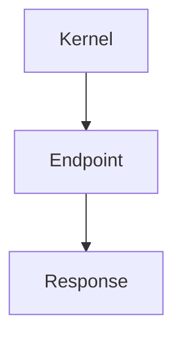

# Flow of an API-call

A request will go through the `Kernel`, which decides which `Endpoint` and which method should be used. The `Endpoint`-instance will then handle the request and retrieve all the needed information. After everything is gathered it will create a new `Response` object an return it. The `Kernel` will use this instance to build the final output.